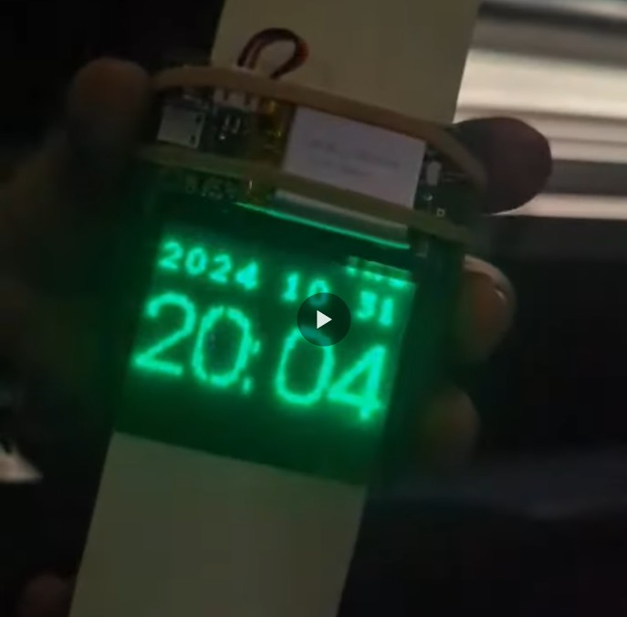
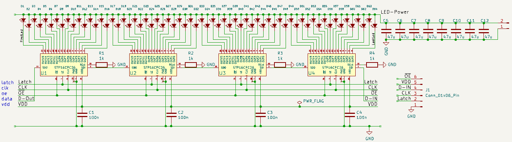
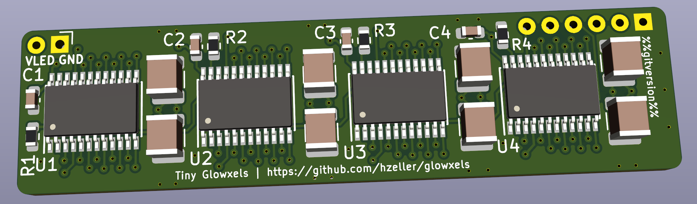

Glowxels - Glow in the Dark Pixels
==================================

Driving 405nm LED line to make a pixelated glow-in-the-dark display.

The pitch is relatively small with 0.8mm for a width of 51.2mm with 64 LEDs.
It is achived with two rows of 1.6mm pitch with 0603 LED mounted in a
zig-zag pattern to have the adjacent pixels without visible gap in X-direction.

The row distance in Y-direction is 4 pixels apart (3.2mm), so even and odd
pixels in a row are sent 4 pixels spaced when sending.

The LEDs are driven by an [STP16CPC26]-chip - a neat 16 bit shift register with
constant current drivers. The serial data is just sent using the SPI bus
(with CS connected Latch), this is super-simple to wire.

The board carries 64 LEDs with two staggered rows of 0603 LEDs with a resulting
pixel-density of 0.8mm.

[STP16CPC26]: http://www.st.com/resource/en/datasheet/stp16cpc26.pdf
