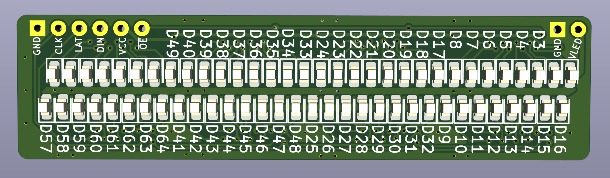

Glowxels - Glow in the Dark Pixels
==================================

Driving 405nm LED line to make a pixelated glow-in-the-dark display.

The pitch is relatively small with 1.5mm (667/meter). It is achived with two
rows with 3mm pitch of 3528 package mounted in a zig-zag pattern to have the
adjacent pixels without visible gap in X-direction.

The row distance in Y-direction is 3 pixels apart (4.5mm), so even and odd
pixels in a row will be sent 3 pixels spaced when sending.

Power for the LEDs is supplied with two rails on the back - in the installation
they are just mounted against two power rails.

The LEDs are driven by an [STP16CPC26]-chip - a neat 16 bit shift register with
constant current drivers. The serial data is just sent using the SPI bus on
the Raspberry Pi (with CS connected Latch), this is super-simple to wire.

Each board carries 64 LEDs and can be chained easily. The first glowxels screen
had 5 boards chained for 320 pixels on a 48cm wide screen.

A Narrow version is in the [feature-20240902-narrow](https://github.com/hzeller/glowxels/tree/feature-20240902-narrow) branch.

[STP16CPC26]: http://www.st.com/resource/en/datasheet/stp16cpc26.pdf
